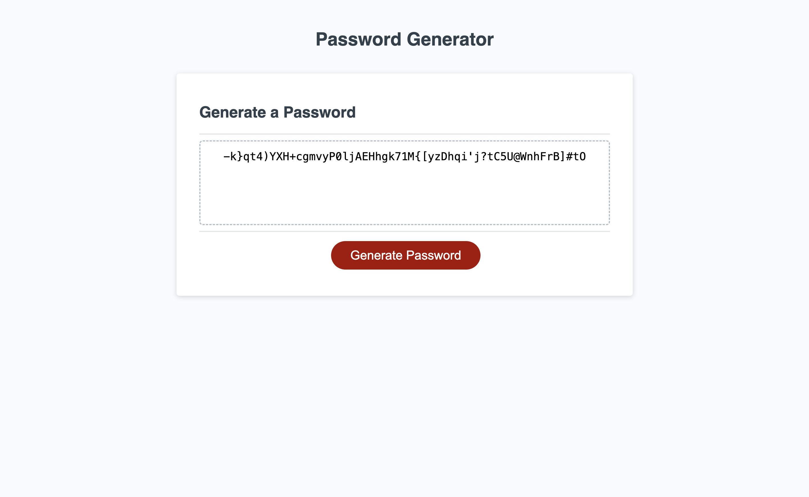

# Password Generator (Module 5 Challenge)
My submission for the Module 5 Password Generator JavaScript challenge

## Description

This is my submission for the Module 5 Password Generator challenge. The challenge was to create a password generator web app that takes in user input and outputs a randomly generated password following predetermined criteria. Users are able to choose the desired password length and also select from a range of character type options (uppercase, special characters, etc.)

## Installation

No installation is necessary. The project should be viewed within the browser by following the link below.

## Usage

The webpage can be accessed via the following url: https://jonathon10k.github.io/Password-Generator

## Credits

N/A

## License

N/A
